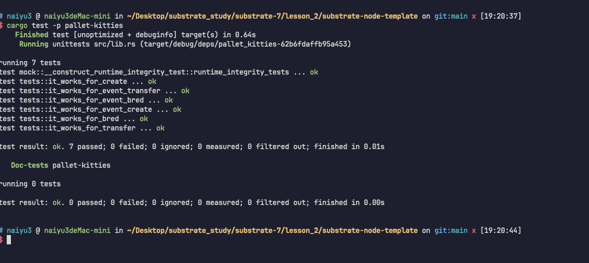
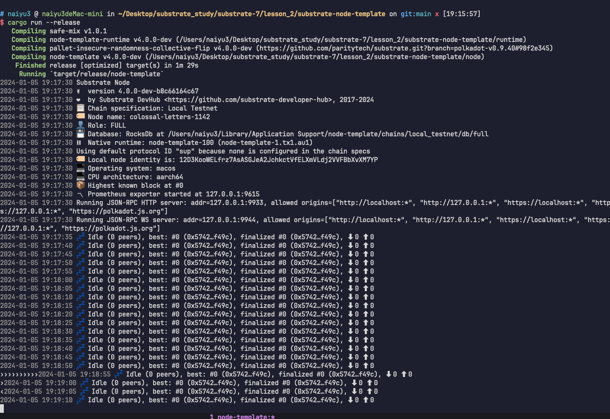

## lesson 2

### 04
· Pallet编译成功
· 单元测试通过


· 加入kitties pallet到runtime中,node可以编译通过
· node节点可以正常启动



### 05
. Improve unit test 改进单元测试
· 单元测试可以获取event
· 比较event的值


``` rust

use crate::{mock::*, Error, Event};
use frame_support::{assert_noop, assert_ok};

#[test]
fn it_works_for_create() {
	new_test_ext().execute_with(|| {
		let kitty_id = 0;
		let account_id: u64 = 1;
		// 检查kitty_id 是否可以通过next_kitty_id 获取
		assert_eq!(KittiesModule::next_kitty_id(), kitty_id);
		// 检查能否正常运行
		assert_ok!(KittiesModule::create(RuntimeOrigin::signed(account_id)));
		// 检测kitty值是否update
		assert_eq!(KittiesModule::next_kitty_id(), kitty_id + 1);
		// kitties 是否已经赋值
		assert_eq!(KittiesModule::kitties(kitty_id).is_some(), true);
		// kitty的所有者是否是对的
		assert_eq!(KittiesModule::kitty_owner(kitty_id), Some(account_id));
		// kitty的parents信息
		assert_eq!(KittiesModule::kitty_parents(kitty_id), None);

		// 设置为最大值来触发 无效值错误
		crate::NextKittyId::<Test>::set(crate::KittyId::max_value());
		assert_noop!(
			KittiesModule::create(RuntimeOrigin::signed(account_id)),
			Error::<Test>::InvalidKittyId
		);
	})
}

#[test]
fn it_works_for_bred() {
	new_test_ext().execute_with(|| {
		let kitty_id = 0;
		let account_id: u64 = 1;
		assert_noop!(
			KittiesModule::bred(RuntimeOrigin::signed(account_id), kitty_id, kitty_id),
			Error::<Test>::SameKittyId
		);
		assert_noop!(
			KittiesModule::bred(RuntimeOrigin::signed(account_id), kitty_id, kitty_id + 1),
			Error::<Test>::InvalidKittyId
		);

		assert_ok!(KittiesModule::create(RuntimeOrigin::signed(account_id)));
		assert_ok!(KittiesModule::create(RuntimeOrigin::signed(account_id)));

		assert_eq!(KittiesModule::next_kitty_id(), kitty_id + 2);

		assert_ok!(KittiesModule::bred(RuntimeOrigin::signed(account_id), kitty_id, kitty_id + 1));

		let bred_kitty_id = 2;
		assert_eq!(KittiesModule::next_kitty_id(), bred_kitty_id + 1);
		assert_eq!(KittiesModule::kitties(bred_kitty_id).is_some(), true);
		assert_eq!(KittiesModule::kitty_owner(bred_kitty_id), Some(account_id));

		assert_eq!(KittiesModule::kitty_parents(bred_kitty_id), Some((kitty_id, kitty_id + 1)),);
	})
}

#[test]
fn it_works_for_transfer() {
	new_test_ext().execute_with(|| {
		let kitty_id = 0;
		let account_id: u64 = 1;
		let recipient: u64 = 2;

		assert_ok!(KittiesModule::create(RuntimeOrigin::signed(account_id)));
		assert_eq!(KittiesModule::kitty_owner(kitty_id), Some(account_id));

		assert_noop!(
			KittiesModule::transfer(RuntimeOrigin::signed(recipient), recipient, kitty_id),
			Error::<Test>::NotKittyOwner
		);

		assert_ok!(KittiesModule::transfer(RuntimeOrigin::signed(account_id), recipient, kitty_id));
		assert_eq!(KittiesModule::kitty_owner(kitty_id), Some(recipient));

		assert_ok!(KittiesModule::transfer(RuntimeOrigin::signed(recipient), account_id, kitty_id));
		assert_eq!(KittiesModule::kitty_owner(kitty_id), Some(account_id));
	})
}

#[test]
fn it_works_for_event_create() {
	new_test_ext().execute_with(|| {
		let kitty_id = 0;
		let account_id: u64 = 1;
		// 检查kitty_id 是否可以通过next_kitty_id 获取
		assert_eq!(KittiesModule::next_kitty_id(), kitty_id);
		// 检查能否正常运行

		assert_ok!(KittiesModule::create(RuntimeOrigin::signed(account_id)));

		let kitty = KittiesModule::kitties(kitty_id).unwrap();

		System::assert_has_event(Event::KittyCreated { who: account_id, kitty_id, kitty }.into());

		// 检测kitty值是否update
		assert_eq!(KittiesModule::next_kitty_id(), kitty_id + 1);
		// kitties 是否已经赋值
		assert_eq!(KittiesModule::kitties(kitty_id).is_some(), true);
		// kitty的所有者是否是对的
		assert_eq!(KittiesModule::kitty_owner(kitty_id), Some(account_id));
		// kitty的parents信息
		assert_eq!(KittiesModule::kitty_parents(kitty_id), None);
	})
}

#[test]
fn it_works_for_event_bred() {
	new_test_ext().execute_with(|| {
		let kitty_id = 0;
		let account_id: u64 = 1;
		assert_noop!(
			KittiesModule::bred(RuntimeOrigin::signed(account_id), kitty_id, kitty_id),
			Error::<Test>::SameKittyId
		);
		assert_noop!(
			KittiesModule::bred(RuntimeOrigin::signed(account_id), kitty_id, kitty_id + 1),
			Error::<Test>::InvalidKittyId
		);

		assert_ok!(KittiesModule::create(RuntimeOrigin::signed(account_id)));
		assert_ok!(KittiesModule::create(RuntimeOrigin::signed(account_id)));

		assert_eq!(KittiesModule::next_kitty_id(), kitty_id + 2);

		assert_ok!(KittiesModule::bred(RuntimeOrigin::signed(account_id), kitty_id, kitty_id + 1));
		let event_kid = kitty_id + 2;
		let kitty = KittiesModule::kitties(event_kid).unwrap();
		System::assert_has_event(
			Event::KittyBred { who: account_id, kitty_id: event_kid, kitty }.into(),
		);

		let bred_kitty_id = 2;
		assert_eq!(KittiesModule::next_kitty_id(), bred_kitty_id + 1);
		assert_eq!(KittiesModule::kitties(bred_kitty_id).is_some(), true);
		assert_eq!(KittiesModule::kitty_owner(bred_kitty_id), Some(account_id));

		assert_eq!(KittiesModule::kitty_parents(bred_kitty_id), Some((kitty_id, kitty_id + 1)),);
	})
}

#[test]
fn it_works_for_event_transfer() {
	new_test_ext().execute_with(|| {
		let kitty_id = 0;
		let account_id: u64 = 1;
		let recipient: u64 = 2;

		assert_ok!(KittiesModule::create(RuntimeOrigin::signed(account_id)));
		assert_eq!(KittiesModule::kitty_owner(kitty_id), Some(account_id));

		assert_noop!(
			KittiesModule::transfer(RuntimeOrigin::signed(recipient), recipient, kitty_id),
			Error::<Test>::NotKittyOwner
		);

		assert_ok!(KittiesModule::transfer(RuntimeOrigin::signed(account_id), recipient, kitty_id));
		assert_eq!(KittiesModule::kitty_owner(kitty_id), Some(recipient));


		System::assert_last_event(Event::KittyTransferred { who: account_id, recipient, kitty_id }.into());


		assert_ok!(KittiesModule::transfer(RuntimeOrigin::signed(recipient), account_id, kitty_id));
		assert_eq!(KittiesModule::kitty_owner(kitty_id), Some(account_id));
	})
}

```

