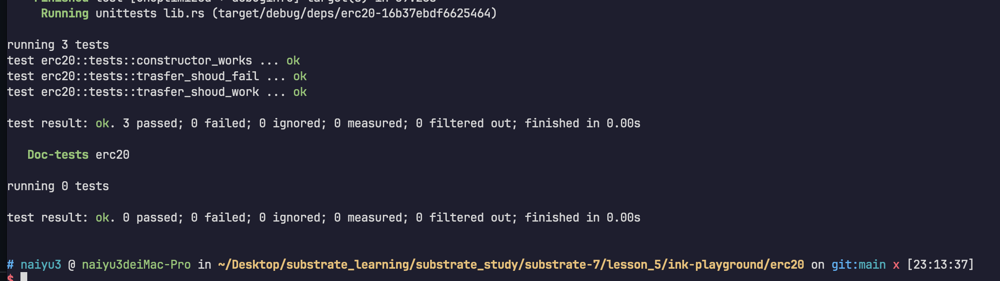
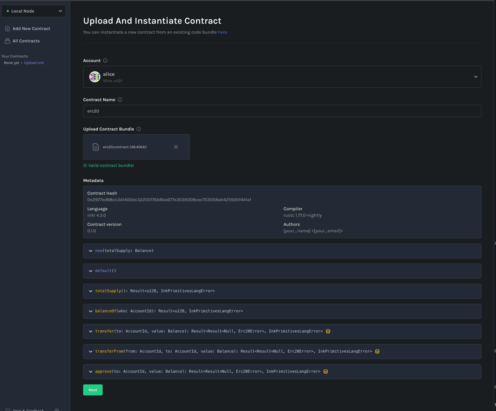
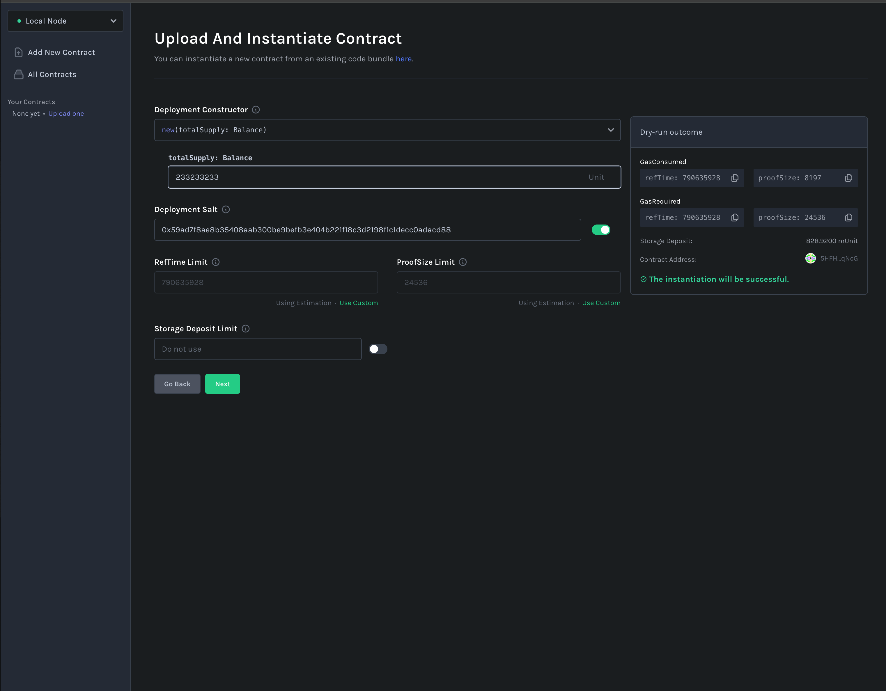
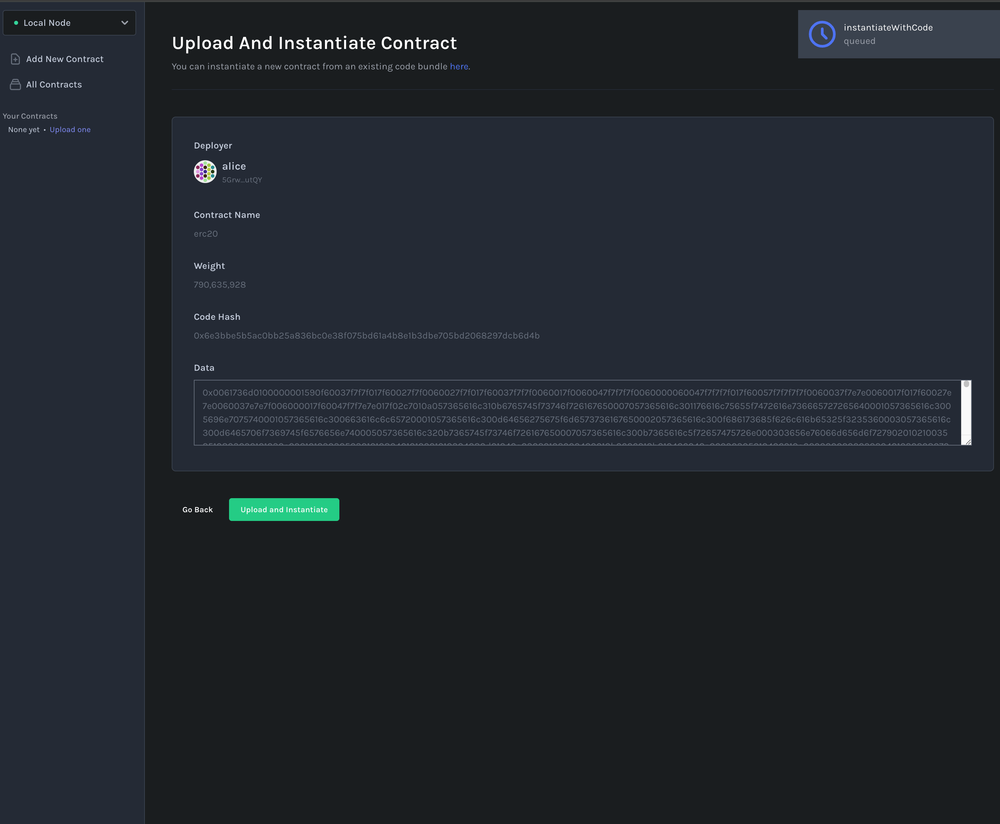
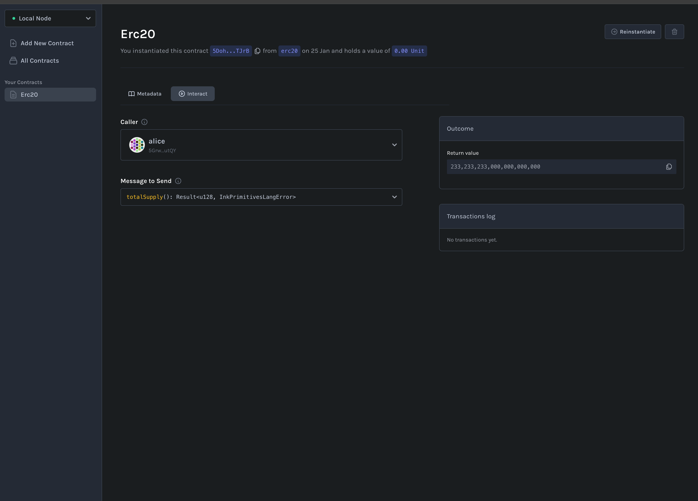
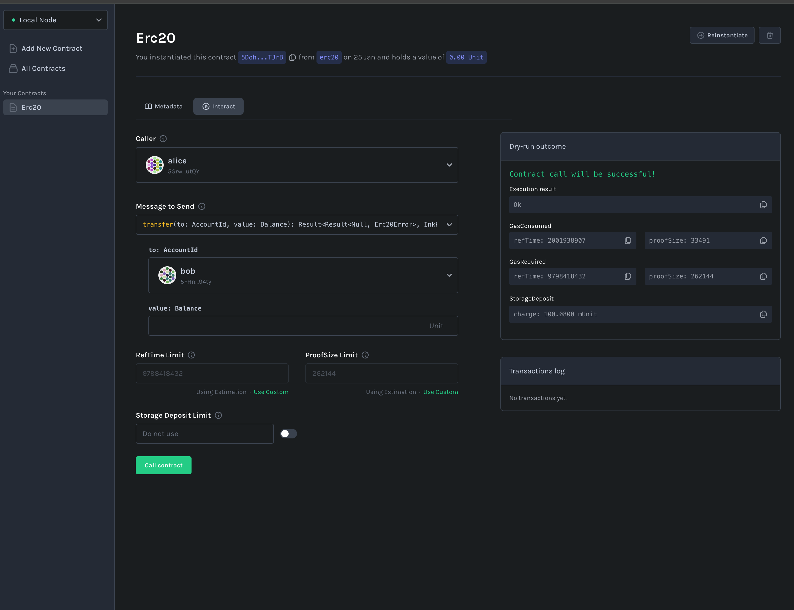
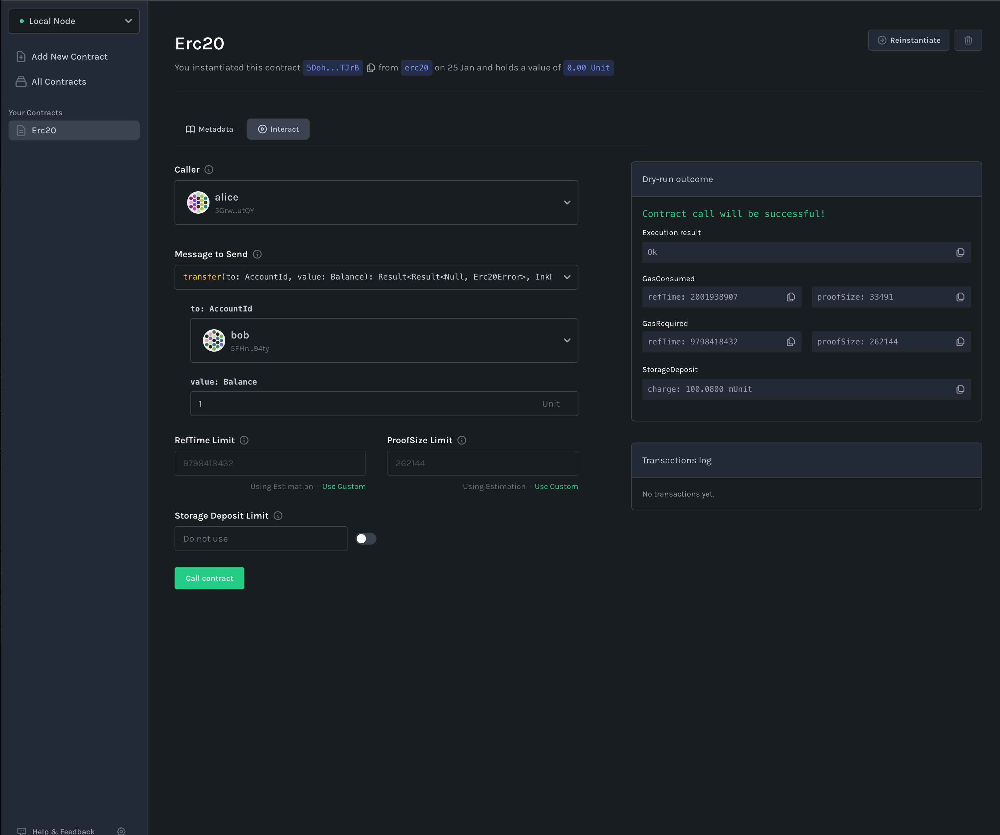
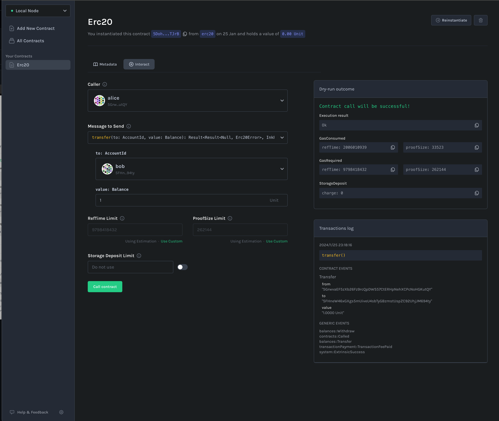

## lesson 5

```
git clone https://github.com/paritytech/substrate-contracts-node.git
cd substrate-contracts-node
git checkout v0.25.0

rustup default nightly-2023-03-18-x86_64-apple-darwin
cargo build --release
./target/release/substrate-contracts-node --dev --tmp


cargo install dylint-link
cargo install cargo-contract

cd ec20
rustup default nightly
cargo contract build

```









