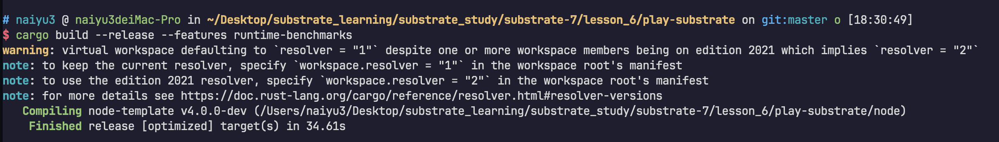

## lesson 6

### 1
```
$ cargo build --release --features runtime-benchmarks

https://github.com/znycat/substrate_study/blob/main/substrate-7/lesson_6/play-substrate/pallets/poe/src/benchmarking.rs

https://github.com/cole8401/substrate-advanced/blob/main/lesson6/第一题/weights.rs
```


### 2
https://github.com/znycat/substrate_study/blob/main/substrate-7/lesson_6/substrate-stencil/stencil-staging-raw.json
https://github.com/znycat/substrate_study/blob/main/substrate-7/lesson_6/substrate-stencil/stencil-staging.json
